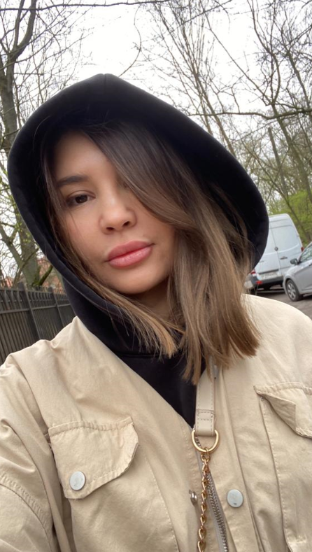

# Обо мне

Всем привет! Меня зовут Света, мне 32 года.

 Я родилась на севере - в городе Якутске. С 2015 г. я живу в самом западном городе нашей страны - в Калининграде (на побережье Балтийского моря). 

 По специальности я инженер, долгое время работала в области геодезии и картографии, автором дипломных работ. В настоящее время учусь в Нетологии по направлению - разработчик Python. 

 В свободное время я люблю проводить время на свежем воздухе - летом мы часто отдыхаем на море с семьей, а зимой - гуляем в скверах и парках. Занимаюсь спортом - это кроссфит. Благодаря спорту я поддерживаю свое физическое и душевное здоровье. У нас большая семья, мы часто собираемся в близком кругу.    

